# README.md

# **🗃️** 간단한 재고 관리/비품 대여 시스템 O2O

## **👋** 서비스 개요

### 기획 목적

- 번번히 수기로 작성해야 하는 비품 대여 신청서와 반납 확인서, 비품 목록 장부 등!
- 기존의 번거로움을 없애기 위해 AIoT를 이용한 무인 대여 물품 관리 사물함을 제작했습니다.

### 주요 기능

- OCR을 이용한 사원증 인식으로 편리한 인증을 수행할 수 있습니다.
- 저희 서비스는 키오스크와 웹 페이지에서 이용할 수 있습니다.
- 사물함에서는 키오스크를 사용해 사원들이 간편하게 물건을 빌릴 수 있도록 하였습니다.
- 사용자 웹 페이지에서는 사원들이 필요한 비품 신청, 장바구니 예약 기능들을 도입해 사원들이 업무 중 필요한 비품에 대해 편하게 요청할 수 있습니다.
- 관리자 웹 페이지에서는 비품 재고 관리, 연체자 관리, 물풍 신청 관리 등 여러 기능을 통해 관리자가 보다 쉽게 비품을 관리할 수 있습니다.

## **👋** 프로젝트 소개

**프로젝트 기간:** 2024.07.08 ~ 2024.08.16 (6주)

| 남은식 | 최다희 | 윤하현 | 김태연 | 이예림 | 김찬민 |
| --- | --- | --- | --- | --- | --- |
| Front-End | Front-End | Front-End | Back-End | Back-End | Back-End |

## **✨** 주요 기능 및 화면

### **📱 키오스크**

**물품 대여**

- OCR을 이용한 사원증 인증을 수행합니다.

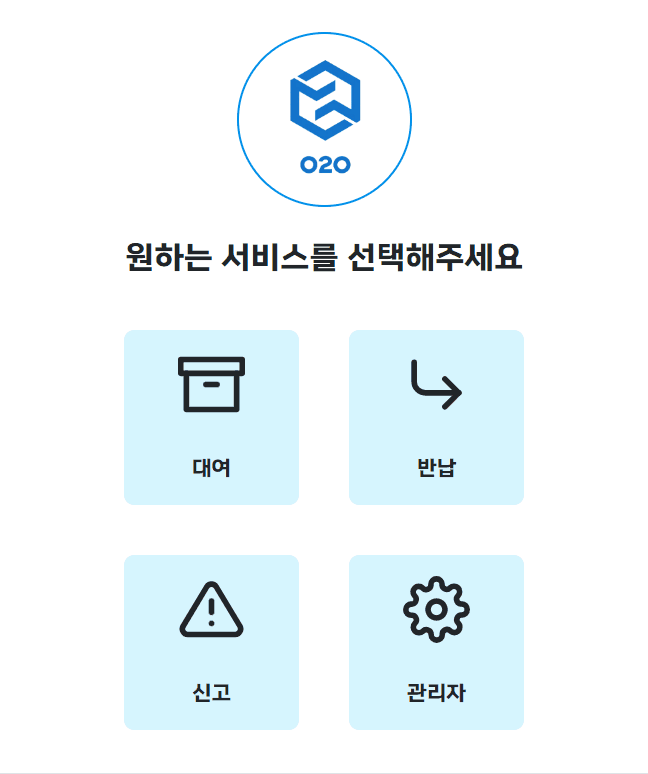

- 물건을 선택하면 해당 물건이 있는 사물함의 문을 자동으로 열립니다.

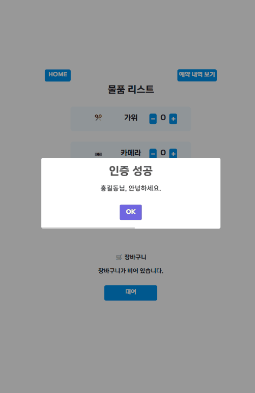

- 대여하고자 하는 물품을 선택한 후 확인을 눌러 물품을 대여합니다.

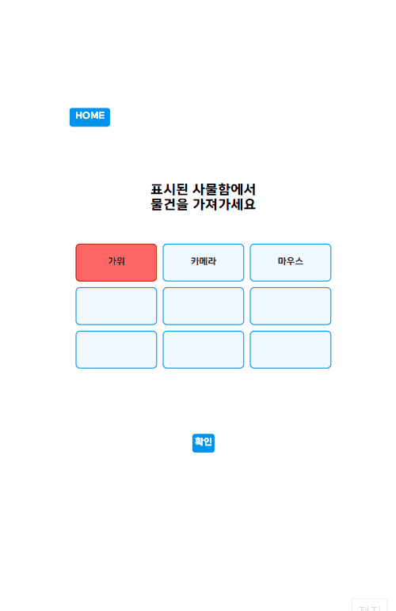

**물품 반납**

- OCR을 이용한 사원증 인증을 수행합니다.

- 사원이 대여한 내역 중 반납하고자 하는 내역을 클릭 합니다.

- 카메라를 통해 반납하고자 하는 물건과 개수를 인식합니다.

- 물품 이상 신고와 등록 또한 물품 대여와 같은 프로세스로 동작합니다. 단, 카메라를 통한 물건 인식은 제외했습니다.

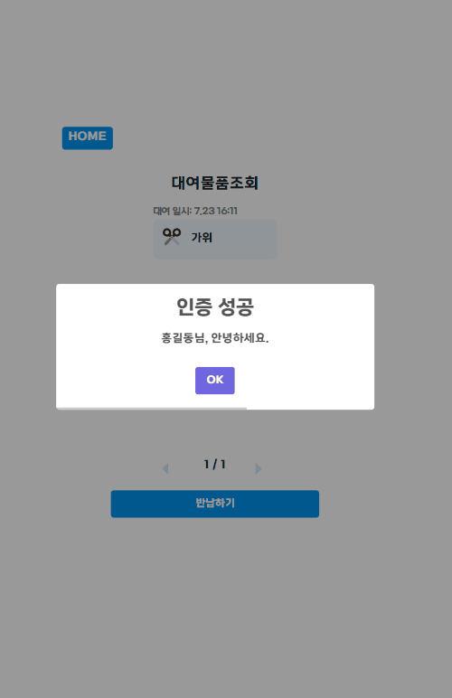

### **🖥️ 사용자 웹 페이지**

**물품 예약하기**

- 사용자 편의성을 위해 웹에서도 원하는 물품을 예약할 수 있습니다.

- 장바구니 상태는 Context API를 사용해 관리했습니다.

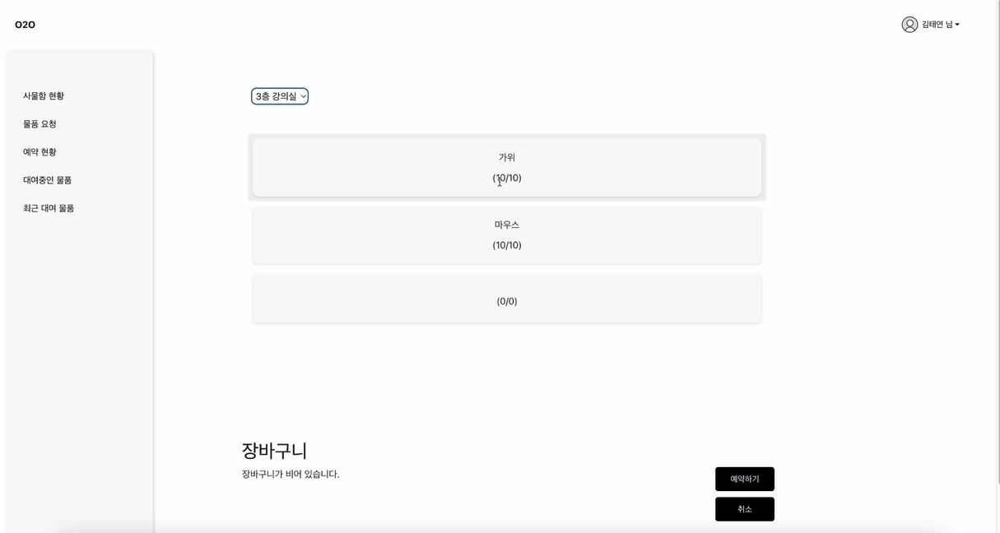

**물품 요청**

- 업무 중 필요한 물품을 바로 요청할 수 있도록 물품을 요청할 수 있습니다.

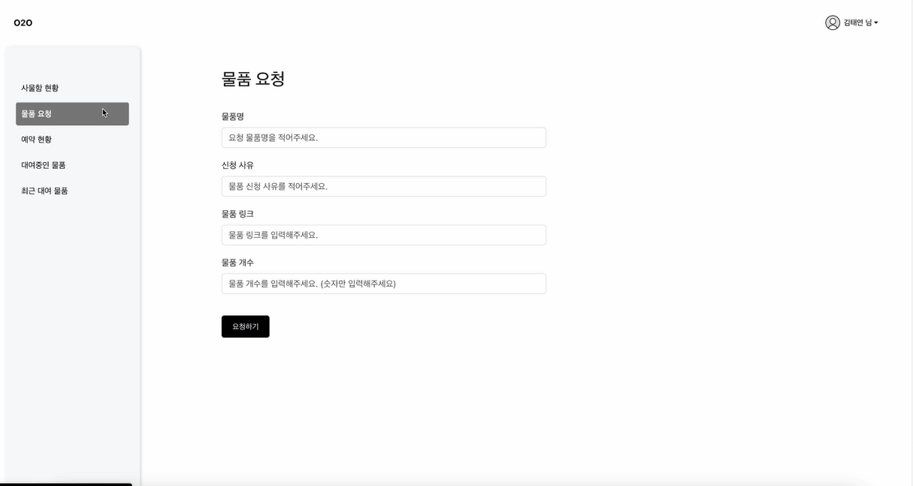

**나의 내역 조회**

- 예약 현황 페이지에서 현재 나의 대여 내역을 조회해 대여 중인 물건을 확인할 수 있습니다.

- 대여 중인 물품 페이지에서 현재 내가 예약한 물품과 남은 시간을 조회할 수 있습니다.

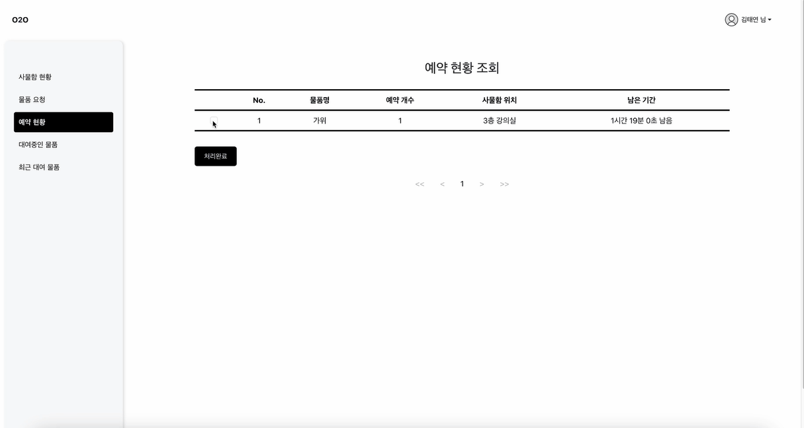

### **🖥️ 관리자 웹 페이지**

**파손, 분실 신고 관리**

- 파손, 분실 신고가 들어온 물품과 신고 사유를 한 눈에 확인할 수 있습니다.

- 신고한 내용을 확인하고 체크박스 클릭으로 완료 처리를 수행할 수 있습니다.

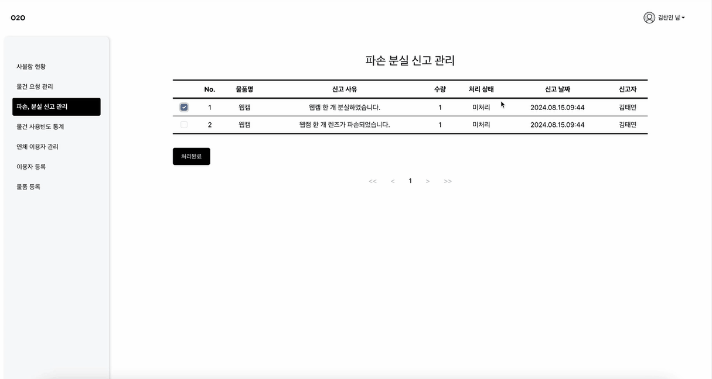

**연체 이용자 관리**

- 연체 이용자를 한 눈에 관리 할 수 있습니다.

- 대여한 장소를 조회할 수 있습니다.

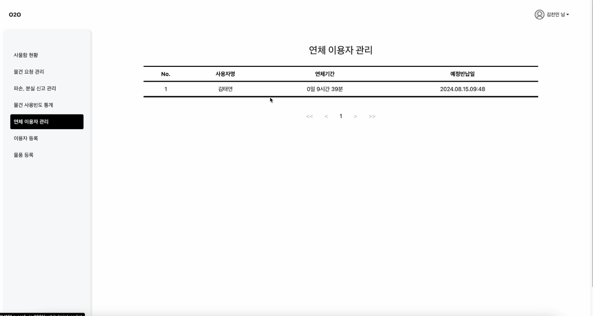

**물건 요청 관리**

- 요청한 물건과 사유 등을 확인하고 수락 및 거절으로 처리할 수 있습니다.

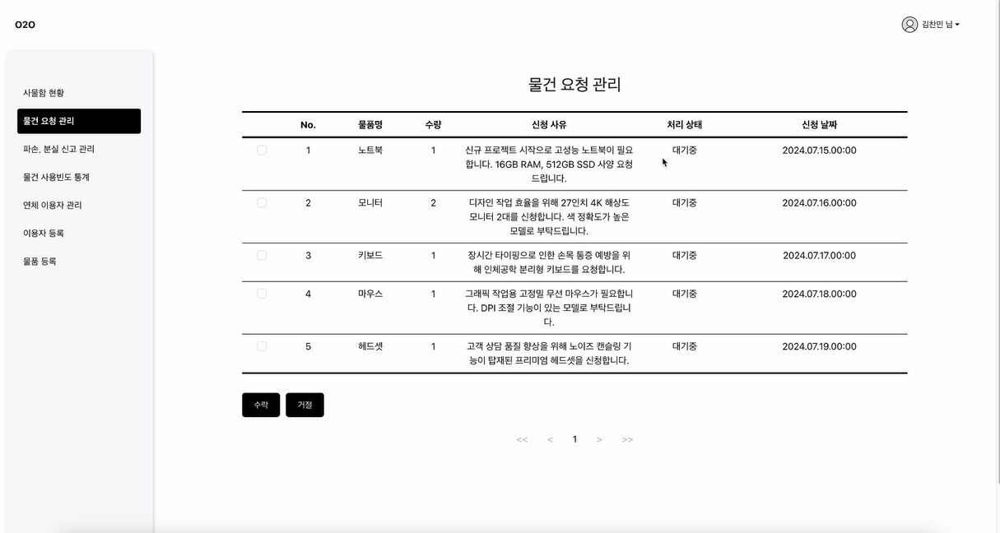

**물품 추가**

- 새로 들어온 물건을 등록할 수 있습니다.

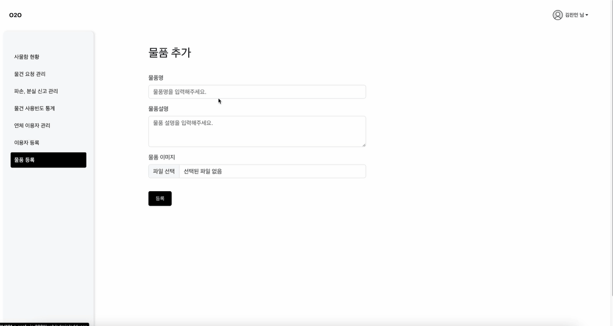

**이용자 등록**

- 회사에 입사자가 생길 경우, 관리자가 사원을 등록할 수 있습니다.

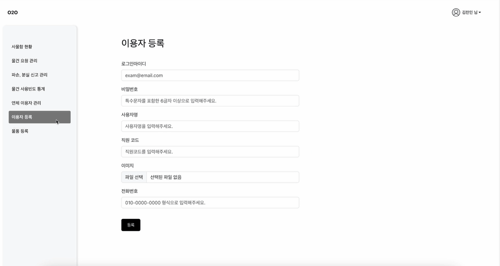

## 🚀 개발 환경

VS Code: 1.64.2

IntelliJ: 11.0.13+7-b1751.21 amd64

JVM: 17.0.1

Node.js: 20.01.0

React: 18.3.1

SERVER: AWS EC2 Ubuntu 20.04.3 LTS

DB: MariaDB(azure), redis

## **✨** git 컨벤션

- git flow 전략을 사용해 브랜치를 관리했습니다.
- 브랜치와 이슈를 함께 생성해 서로의 작업 과정을 관리했습니다.

## **⚒️ 기술 스택**

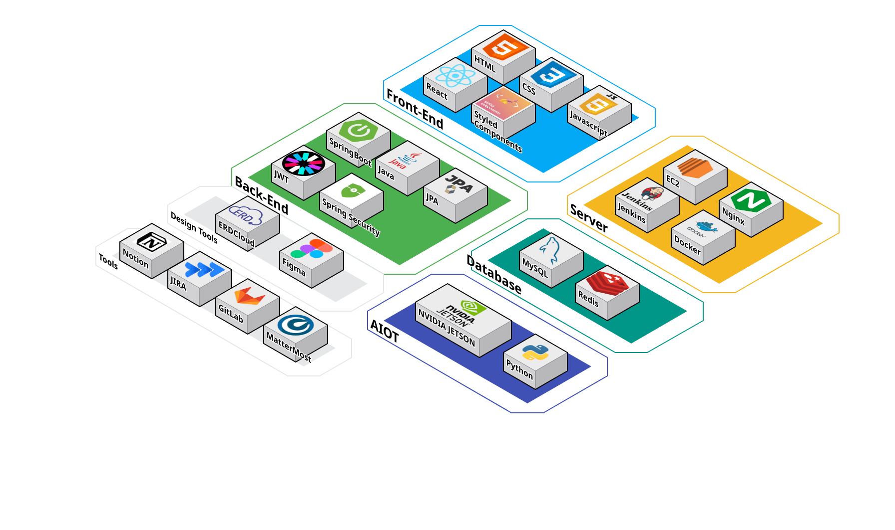

## **🔎 시스템 아키텍처**

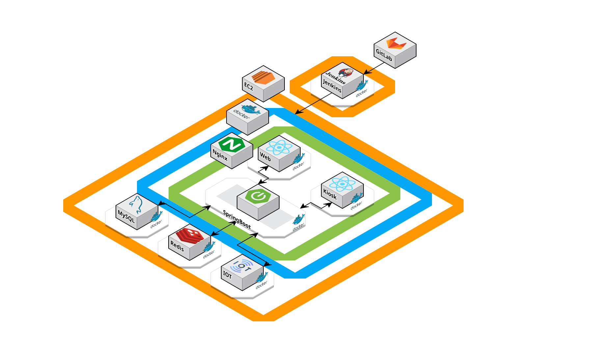

## **✨ ERD**

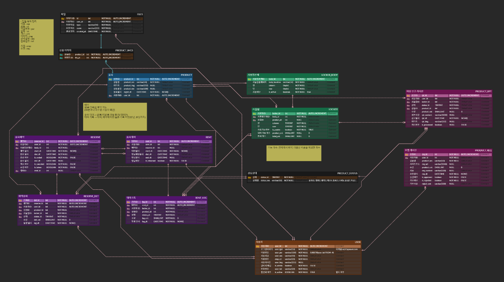
